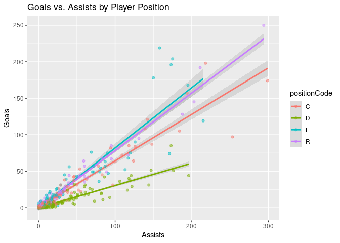
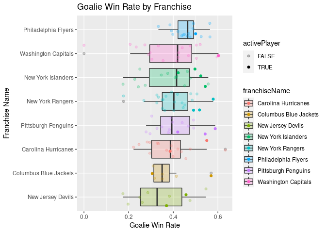

Reading and Summarizing JSON Data
================
Avy Harvey
6/2/2020

  - [JSON 101](#json-101)
  - [Reading JSON in R](#reading-json-in-r)
      - [Packages](#packages)
      - [Consuming JSON from the NHL’s REST
        API](#consuming-json-from-the-nhls-rest-api)
  - [Summarizing Data](#summarizing-data)
      - [Numeric Summaries](#numeric-summaries)
      - [Graphical Summaries](#graphical-summaries)

This goal of this vignette is to show how to read and summarize a JSON
data set in R. The JSON data used in the examples is from the National
Hockey League REST API.

## JSON 101

**JSON** (JavaScript Object Notation) is a text-based, lightweight,
structured data format that’s easy to read and write. It’s also easy for
computers to read and write\! JSON is a very common format used by
web-based APIs (i.e., REST APIs) to transfer data between a client and
server, and is used to store data in some popular NoSQL databases, such
as MongoDB.

The beauty of the JSON format is in its simplicity. The main building
block of JSON data is the **name-value pair** (also called key-value
pairs). JSON **objects** are made up of zero or more name-value pairs.
We’ll be working with NHL data, so let’s describe the Carolina
Hurricanes NHL franchise using the JSON format. JSON objects start with
`{` and end with `}`. In between, we can specify name-value pairs, such
as `name: "Carolina Hurricanes"`, or `city: "Raleigh"`. Let’s combine
these ideas to start describing the Carolina Hurricanes as a JSON
object:

    {
      name: "Carolina Hurricanes",
      city: "Raleigh"
    }

You may notice that the two name-value pairs above are separated by a
comma (`,`) character. This is how the JSON format is able to tell when
one name-value pair ends and another begins. The whitespace (e.g.,
spaces, line breaks) doesn’t matter, but it can make the data easier for
humans to read.

Something important to note is that JSON only allows a name to exist at
most once within an object. This is something that helps make JSON
readable for humans and machines – if you want to find a name in an
object, you can be assured that at most one will exist. Adding a second
`city: "Raleigh"` or `city: "Somewhere Else"` pair to the object would
be invalid.

In the example so far, I’ve only used strings as values: “Carolina
Hurricanes” and “Raleigh”. However, JSON allows for many different types
of values: strings, numbers, dates, arrays (we’ll get to those), and
even other objects\! Here’s an example that illustrates some of these
types:

    {
      name: "Carolina Hurricanes",
      location: {
        city: "Raleigh",
        state: "NC",
      },
      num_notable_players: 2,
      notable_players: ["Ron Francis", "Rod Brind'Amour"]
    }

Now that we see how JSON objects are formed, let’s talk about
**arrays**. JSON arrays are lists of items. These items can be anything
a JSON value can be: strings, numbers, dates, arrays, or objects. In the
above example, the value of the`notable_players` key is an array of
strings. When querying REST APIs, you’ll likely encounter arrays
frequently.

Why someone would choose to store their data in JSON format? Here are a
few reasons:

  - Easy to read and write
  - Data relationships can be nested in the document itself (as opposed
    to typical RDBMS schemas)
  - Lightweight textual data transfer
  - Parsing/writing supported by many programming languages

These resources provide additional description and examples of JSON:

  - <https://www.json.org/json-en.html>
  - <https://www.w3schools.com/js/js_json_intro.asp>
  - <https://www.infoworld.com/article/3222851/what-is-json-a-better-format-for-data-exchange.html>

## Reading JSON in R

### Packages

Now that you know the basics of JSON, how can JSON data be read in R?

There are three major packages for handling JSON data:

  - rjson
  - RJSONIO
  - jsonlite

[This
page](https://rstudio-pubs-static.s3.amazonaws.com/31702_9c22e3d1a0c44968a4a1f9656f1800ab.html)
shows some examples of using each of the above packages to compare
behaviors, and also provides some performance metrics for parsing and
writing JSON.

Each of the above packages can parse and write JSON (though each one has
its own nuances). The respective methods are named `fromJSON` and
`toJSON` in each package. RJSONIO and jsonlite seem to be more
full-featured than rjson when it comes to prettifying (inserting
whitespace to make JSON more readable for humans) and simplification.
rjson is has the fastest performance of the three packages, with RJSONIO
being the slowest (by far).

I’ll be using jsonlite in the rest of this vignette since it is more
full-featured than rjson and better performing than RJSONIO. However,
you can probably adapt my examples to either of the other two packages
if you like.

### Consuming JSON from the NHL’s REST API

After installing the jsonlite and httr packages with
`install.packages(c("jsonlite", "httr"))`, let’s read some data\!

First, load the libraries:

``` r
library(jsonlite)
library(httr)
```

The base URL where we will be pulling this data from is
`https://records.nhl.com/site/api`. All retrievals are HTTP `GET`
requests.

The following functions can be used to retrieve and parse data from the
respective endpoints:

#### Franchises

Gets the list of NHL franchises from the `/franchise` endpoint.

Returns a tibble with `id`, `firstSeasonId`, `lastSeasonId`, and `name`
of every team in the history of the NHL.

``` r
get_franchises <- function() {
  base_url <- "https://records.nhl.com/site/api"
  
  # Get the list of NHL franchises
  response <- GET(url = paste0(base_url, "/franchise")) %>%
    content(as = "text", encoding = "UTF-8") %>%
    fromJSON()
  
  # Get the data attribute from the JSON object
  as_tibble(response$data)
}

# Example usage
get_franchises()
```

    ## # A tibble: 38 x 6
    ##       id firstSeasonId lastSeasonId mostRecentTeamId teamCommonName
    ##    <int>         <int>        <int>            <int> <chr>         
    ##  1     1      19171918           NA                8 Canadiens     
    ##  2     2      19171918     19171918               41 Wanderers     
    ##  3     3      19171918     19341935               45 Eagles        
    ##  4     4      19191920     19241925               37 Tigers        
    ##  5     5      19171918           NA               10 Maple Leafs   
    ##  6     6      19241925           NA                6 Bruins        
    ##  7     7      19241925     19371938               43 Maroons       
    ##  8     8      19251926     19411942               51 Americans     
    ##  9     9      19251926     19301931               39 Quakers       
    ## 10    10      19261927           NA                3 Rangers       
    ## # … with 28 more rows, and 1 more variable: teamPlaceName <chr>

#### Franchise Team Statistics

Gets franchise team total statistics from the `franchise-team-totals`
endpoint.

Returns a tibble of total statistics for every franchise (e.g.,
`roadTies`, `roadWins`, etc.).

``` r
get_franchise_stats <- function() {
  base_url <- "https://records.nhl.com/site/api"
  
  # Get the list of NHL franchises
  response <- GET(url = paste0(base_url, "/franchise-team-totals")) %>%
    content(as = "text", encoding = "UTF-8") %>%
    fromJSON()
  
  # Get the data attribute from the JSON object
  as_tibble(response$data)
}

# Example usage
get_franchise_stats()
```

    ## # A tibble: 104 x 30
    ##       id activeFranchise firstSeasonId franchiseId gameTypeId gamesPlayed
    ##    <int>           <int>         <int>       <int>      <int>       <int>
    ##  1     1               1      19821983          23          2        2937
    ##  2     2               1      19821983          23          3         257
    ##  3     3               1      19721973          22          2        3732
    ##  4     4               1      19721973          22          3         272
    ##  5     5               1      19261927          10          2        6504
    ##  6     6               1      19261927          10          3         515
    ##  7     7               1      19671968          16          3         433
    ##  8     8               1      19671968          16          2        4115
    ##  9     9               1      19671968          17          2        4115
    ## 10    10               1      19671968          17          3         381
    ## # … with 94 more rows, and 24 more variables: goalsAgainst <int>,
    ## #   goalsFor <int>, homeLosses <int>, homeOvertimeLosses <int>, homeTies <int>,
    ## #   homeWins <int>, lastSeasonId <int>, losses <int>, overtimeLosses <int>,
    ## #   penaltyMinutes <int>, pointPctg <dbl>, points <int>, roadLosses <int>,
    ## #   roadOvertimeLosses <int>, roadTies <int>, roadWins <int>,
    ## #   shootoutLosses <int>, shootoutWins <int>, shutouts <int>, teamId <int>,
    ## #   teamName <chr>, ties <int>, triCode <chr>, wins <int>

#### Season Records by Franchise

Gets season records for a specific franchise from the
`/franchise-season-records` endpoint.

Expects a franchise ID to be provided.

Returns a tibble of the season records for the franchise associated with
the provided franchise ID.

``` r
get_season_records_by_franchise <- function(franchise_id) {
  base_url <- "https://records.nhl.com/site/api"
  
  # Get the list of NHL franchises
  response <- GET(url = paste0(base_url, "/franchise-season-records?cayenneExp=franchiseId=", franchise_id)) %>%
    content(as = "text", encoding = "UTF-8") %>%
    fromJSON()
  
  # Get the data attribute from the JSON object
  as_tibble(response$data)
}

# Example usage ('26' is the franchise ID for the Carolina Hurricanes)
get_season_records_by_franchise(26)
```

    ## # A tibble: 1 x 57
    ##      id fewestGoals fewestGoalsAgai… fewestGoalsAgai… fewestGoalsSeas…
    ##   <int>       <int>            <int> <chr>            <chr>           
    ## 1    12         171              202 1998-99 (82)     2002-03 (82)    
    ## # … with 52 more variables: fewestLosses <int>, fewestLossesSeasons <chr>,
    ## #   fewestPoints <int>, fewestPointsSeasons <chr>, fewestTies <int>,
    ## #   fewestTiesSeasons <chr>, fewestWins <int>, fewestWinsSeasons <chr>,
    ## #   franchiseId <int>, franchiseName <chr>, homeLossStreak <int>,
    ## #   homeLossStreakDates <chr>, homePointStreak <int>,
    ## #   homePointStreakDates <chr>, homeWinStreak <int>, homeWinStreakDates <chr>,
    ## #   homeWinlessStreak <int>, homeWinlessStreakDates <chr>, lossStreak <int>,
    ## #   lossStreakDates <chr>, mostGameGoals <int>, mostGameGoalsDates <chr>,
    ## #   mostGoals <int>, mostGoalsAgainst <int>, mostGoalsAgainstSeasons <chr>,
    ## #   mostGoalsSeasons <chr>, mostLosses <int>, mostLossesSeasons <chr>,
    ## #   mostPenaltyMinutes <int>, mostPenaltyMinutesSeasons <chr>,
    ## #   mostPoints <int>, mostPointsSeasons <chr>, mostShutouts <int>,
    ## #   mostShutoutsSeasons <chr>, mostTies <int>, mostTiesSeasons <chr>,
    ## #   mostWins <int>, mostWinsSeasons <chr>, pointStreak <int>,
    ## #   pointStreakDates <chr>, roadLossStreak <int>, roadLossStreakDates <chr>,
    ## #   roadPointStreak <int>, roadPointStreakDates <chr>, roadWinStreak <int>,
    ## #   roadWinStreakDates <chr>, roadWinlessStreak <int>,
    ## #   roadWinlessStreakDates <chr>, winStreak <int>, winStreakDates <chr>,
    ## #   winlessStreak <lgl>, winlessStreakDates <lgl>

#### Goalie Records by Franchise

Gets goalie records for a specific franchise from the
`/franchise-goalie-records` endpoint.

Expects a franchise ID to be provided.

Returns a tibble of the goalie records for the franchise associated with
the provided franchise ID.

``` r
get_goalie_records_by_franchise <- function(franchise_id) {
  base_url <- "https://records.nhl.com/site/api"
  
  # Get the list of NHL franchises
  response <- GET(url = paste0(base_url, "/franchise-goalie-records?cayenneExp=franchiseId=", franchise_id)) %>%
    content(as = "text", encoding = "UTF-8") %>%
    fromJSON()
  
  # Get the data attribute from the JSON object
  as_tibble(response$data)
}

# Example usage ('26' is the franchise ID for the Carolina Hurricanes)
get_goalie_records_by_franchise(26)
```

    ## # A tibble: 38 x 29
    ##       id activePlayer firstName franchiseId franchiseName gameTypeId gamesPlayed
    ##    <int> <lgl>        <chr>           <int> <chr>              <int>       <int>
    ##  1   277 FALSE        Cam                26 Carolina Hur…          2         668
    ##  2   310 FALSE        Arturs             26 Carolina Hur…          2         309
    ##  3   336 FALSE        Tom                26 Carolina Hur…          2          34
    ##  4   363 FALSE        Richard            26 Carolina Hur…          2           6
    ##  5   369 FALSE        Sean               26 Carolina Hur…          2         256
    ##  6   411 FALSE        Mark               26 Carolina Hur…          2           3
    ##  7   425 FALSE        John               26 Carolina Hur…          2         122
    ##  8   430 FALSE        Mario              26 Carolina Hur…          2          23
    ##  9   470 FALSE        Pat                26 Carolina Hur…          2           5
    ## 10   490 FALSE        Mike               26 Carolina Hur…          2         252
    ## # … with 28 more rows, and 22 more variables: lastName <chr>, losses <int>,
    ## #   mostGoalsAgainstDates <chr>, mostGoalsAgainstOneGame <int>,
    ## #   mostSavesDates <chr>, mostSavesOneGame <int>, mostShotsAgainstDates <chr>,
    ## #   mostShotsAgainstOneGame <int>, mostShutoutsOneSeason <int>,
    ## #   mostShutoutsSeasonIds <chr>, mostWinsOneSeason <int>,
    ## #   mostWinsSeasonIds <chr>, overtimeLosses <int>, playerId <int>,
    ## #   positionCode <chr>, rookieGamesPlayed <int>, rookieShutouts <int>,
    ## #   rookieWins <int>, seasons <int>, shutouts <int>, ties <int>, wins <int>

#### Skater Records by Franchise

Gets skater records for a specific franchise from the
`/franchise-skater-records` endpoint.

Expects a franchise ID to be provided.

Returns a tibble of the skater records for the franchise associated with
the provided franchise ID.

``` r
get_skater_records_by_franchise <- function(franchise_id) {
  base_url <- "https://records.nhl.com/site/api"
  
  # Get the list of NHL franchises
  response <- GET(url = paste0(base_url, "/franchise-skater-records?cayenneExp=franchiseId=", franchise_id)) %>%
    content(as = "text", encoding = "UTF-8") %>%
    fromJSON()
  
  # Get the data attribute from the JSON object
  as_tibble(response$data)
}

# Example usage ('26' is the franchise ID for the Carolina Hurricanes)
get_skater_records_by_franchise(26)
```

    ## # A tibble: 478 x 30
    ##       id activePlayer assists firstName franchiseId franchiseName gameTypeId
    ##    <int> <lgl>          <int> <chr>           <int> <chr>              <int>
    ##  1 16900 FALSE            793 Ron                26 Carolina Hur…          2
    ##  2 17018 FALSE            294 Kevin              26 Carolina Hur…          2
    ##  3 17055 FALSE            158 Blaine             26 Carolina Hur…          2
    ##  4 17090 FALSE            126 Mike               26 Carolina Hur…          2
    ##  5 17111 FALSE             79 Torrie             26 Carolina Hur…          2
    ##  6 17156 FALSE            211 Pat                26 Carolina Hur…          2
    ##  7 17170 FALSE            147 Mark               26 Carolina Hur…          2
    ##  8 17237 FALSE             11 Thommy             26 Carolina Hur…          2
    ##  9 17239 FALSE              0 Jim                26 Carolina Hur…          2
    ## 10 17257 FALSE             13 Greg               26 Carolina Hur…          2
    ## # … with 468 more rows, and 23 more variables: gamesPlayed <int>, goals <int>,
    ## #   lastName <chr>, mostAssistsGameDates <chr>, mostAssistsOneGame <int>,
    ## #   mostAssistsOneSeason <int>, mostAssistsSeasonIds <chr>,
    ## #   mostGoalsGameDates <chr>, mostGoalsOneGame <int>, mostGoalsOneSeason <int>,
    ## #   mostGoalsSeasonIds <chr>, mostPenaltyMinutesOneSeason <int>,
    ## #   mostPenaltyMinutesSeasonIds <chr>, mostPointsGameDates <chr>,
    ## #   mostPointsOneGame <int>, mostPointsOneSeason <int>,
    ## #   mostPointsSeasonIds <chr>, penaltyMinutes <int>, playerId <int>,
    ## #   points <int>, positionCode <chr>, rookiePoints <int>, seasons <int>

#### Players by Team

Gets the players for a specific team from the `/player/byTeam/{teamId}`
endpoint.

Expects a team ID to be provided.

Returns a tibble of the players for the team associated with the
provided team ID.

``` r
get_players_by_franchise <- function(franchise_id) {
  base_url <- "https://records.nhl.com/site/api"
  
  # Get the list of NHL franchises
  response <- GET(url = paste0(base_url, "/player/byTeam/", franchise_id)) %>%
    content(as = "text", encoding = "UTF-8") %>%
    fromJSON()
  
  # Get the data attribute from the JSON object
  as_tibble(response$data)
}

# Example usage ('12' is the team ID for the Carolina Hurricanes)
get_players_by_franchise(12) %>%
  filter(onRoster == "Y")
```

    ## # A tibble: 20 x 71
    ##        id accruedSeasons addNames ageSignWaiver ageSignelFa alert birthCity
    ##     <int>          <int> <chr>            <int>       <int> <chr> <chr>    
    ##  1 8.47e6             19 Justin              19          18 N     Cobourg  
    ##  2 8.47e6              9 James               20          20 N     Morweena 
    ##  3 8.47e6             13 Jordan              18          18 N     Thunder …
    ##  4 8.47e6              7 Jake                21          21 N     Minneton…
    ##  5 8.48e6              7 <NA>                18          18 N     Chur     
    ##  6 8.48e6              6 <NA>                19          19 N     Ostrava  
    ##  7 8.48e6              3 <NA>                22          22 N     Wheaton  
    ##  8 8.48e6              5 <NA>                19          19 N     Pittsbur…
    ##  9 8.48e6              4 <NA>                20          20 N     Brandon  
    ## 10 8.48e6              3 <NA>                21          21 N     Lakeville
    ## 11 8.48e6              4 <NA>                19          19 N     Helsinki 
    ## 12 8.48e6              4 <NA>                20          20 N     Brandon  
    ## 13 8.48e6              3 <NA>                19          19 N     Fergus   
    ## 14 8.48e6              4 <NA>                21          21 N     Denver   
    ## 15 8.48e6              5 <NA>                23          23 N     Middleto…
    ## 16 8.48e6              2 <NA>                18          18 N     Carlyle  
    ## 17 8.48e6              1 <NA>                21          21 N     Markham  
    ## 18 8.48e6              3 <NA>                19          19 N     Rauma    
    ## 19 8.48e6              0 <NA>                18          18 N     Nove Mes…
    ## 20 8.48e6              1 <NA>                18          18 N     Barnaul  
    ## # … with 64 more variables: birthCountry <chr>, birthDate <chr>,
    ## #   birthStateProvince <chr>, careerTeamId <lgl>,
    ## #   centralRegistryPosition <chr>, clubElecArb <chr>, currentTeamId <int>,
    ## #   dateOfDeath <lgl>, ddaId <int>, deceased <lgl>, epPlayerId <int>,
    ## #   faGroupAfterSeason <lgl>, firstName <chr>, firstSignedByTeamId <int>,
    ## #   freeAgentGroup <chr>, fullName <chr>, group5Election <chr>,
    ## #   group5SeasonsEarned <int>, group6Proration <lgl>,
    ## #   group6SeasonsEarned <int>, groupsEarnedThruSeason <int>, height <int>,
    ## #   hofInductionYear <lgl>, homeTown <chr>, iihfHofInductionYear <lgl>,
    ## #   inHockeyHof <lgl>, inIihfHof <int>, inTop100Alltime <int>,
    ## #   inUsHockeyHof <lgl>, isDefected <chr>, isDeleted <chr>, isJunior <chr>,
    ## #   isRetired <lgl>, isRookie <chr>, isSuspended <chr>,
    ## #   lastAmateurLeagueId <int>, lastAmateurTeamId <int>, lastNHLTeamId <int>,
    ## #   lastName <chr>, loanCapException <chr>, longTermInjury <chr>,
    ## #   message <chr>, middleName <lgl>, nationality <chr>, nhlExperience <int>,
    ## #   onRoster <chr>, platformYear <int>, position <chr>, prName <chr>,
    ## #   prStat <int>, proYearReduction <int>, reentryWaivers <chr>,
    ## #   rosterSpecialCode <lgl>, salaryArbitrationExp <int>, shootsCatches <chr>,
    ## #   sweaterNumber <int>, updateTimestamp <chr>, usHofInductionYear <lgl>,
    ## #   vetCapExcptn <chr>, waiverAmount <int>, waiverDraft <chr>,
    ## #   waiverStatus <chr>, weight <int>, yearsPro <int>

## Summarizing Data

Once you have the functions to query the data, you should perform a
basic exploratory data analysis. Not all things reported need to show
something interesting or meaningful (i.e. graphs that show no
relationship are fine) but you should discuss each graph (if you don’t
know hockey, that is ok - simply discuss the graphs and summaries as
best you can). A few requirements are below:

– You should create a new variable at some point – You should create
some contingency tables and numeric summaries by some of your
categorical variables – You should create some plots (at least a
side-by-side bar plot, side-by-side box plots, and scatterplots with
coloring)

### Numeric Summaries

#### Active Player Positions by Team (Metro Division)

Q: How have teams in the Metropolitan divison allocated their current
rosters with respect to skaters?

``` r
# Helper function to look up franchise IDs by team common name
get_franchise_id_by_name <- function(franchise_common_name) {
  get_franchises() %>%
    filter(is.na(lastSeasonId) & teamCommonName == franchise_common_name) %>%
    select(id) %>%
    pull()
}

get_team_id_by_name <- function(franchise_common_name) {
  get_franchises() %>%
    filter(is.na(lastSeasonId) & teamCommonName == franchise_common_name) %>%
    select(mostRecentTeamId) %>%
    pull()
}

# Teams in the Metro division
metro_division_names = c("Capitals", "Penguins", "Rangers", "Flyers", 
                         "Islanders", "Devils", "Blue Jackets", "Hurricanes")

# IDs of the Metro franchises
metro_division_franchise_ids <- sapply(metro_division_names, get_franchise_id_by_name)
metro_division_team_ids <- sapply(metro_division_names, get_team_id_by_name)

# Get the skater records for all Metro teams
metro_skater_records_tbl <- lapply(metro_division_franchise_ids, get_skater_records_by_franchise) %>%
  bind_rows()

# Get only the players on the NHL roster for all Metro teams
metro_players_tbl <- lapply(metro_division_team_ids, get_players_by_franchise) %>%
  bind_rows() %>%
  filter(onRoster == "Y") %>%
  left_join(get_franchises() %>%
              select(id, mostRecentTeamId) %>%
              rename(franchiseId = id),
            by = c("currentTeamId" = "mostRecentTeamId"))

# We only want active players who still play for the franchise in this report
metro_skater_records_tbl %>%
  semi_join(metro_players_tbl, by = c("playerId" = "id", "franchiseId" = "franchiseId")) %>%
  select(franchiseName, positionCode) %>%
  table(dnn = c("Franchise Name", "Position")) %>%
  addmargins() %>%
  knitr::kable(caption = "Skater Positions by Franchise")
```

|                       |  C |  D |  L |  R | Sum |
| --------------------- | -: | -: | -: | -: | --: |
| Carolina Hurricanes   |  5 |  6 |  4 |  3 |  18 |
| Columbus Blue Jackets | 11 |  8 |  3 |  2 |  24 |
| New Jersey Devils     |  7 |  7 |  3 |  2 |  19 |
| New York Islanders    |  4 |  8 |  7 |  5 |  24 |
| New York Rangers      |  5 |  6 |  4 |  4 |  19 |
| Philadelphia Flyers   |  7 |  7 |  2 |  3 |  19 |
| Pittsburgh Penguins   | 11 |  8 |  3 |  2 |  24 |
| Washington Capitals   |  5 |  7 |  4 |  4 |  20 |
| Sum                   | 55 | 57 | 30 | 25 | 167 |

Skater Positions by Franchise

The contingency table above shows the positions of all the active
players for the respective franchises. Note this data includes players
who have short-term injuries, as well as those who have been called up
from a minor league team (e.g., AHL or EHCL) to temporarily take their
place. From this table, I noticed a few things:

  - The Columbus Blue Jackets and Pittsburgh Penguins are loaded with
    centermen (possibly due to short-term injuries, but it could also be
    strategy)
      - It’s somewhat surprising that the number of centermen is almost
        the same as the number of defensemen
  - Overall, these teams invest a little more in left wings than right
    wings
      - Right wings have the smallest individual number of any position
        on most teams
  - The teams with more than 21 players likely have several short-term
    injuries, since the two goalies on each team would bring the roster
    to 23 if everyone was able to play

#### Player Position vs. Tenure with Carolina

Q: Is there a relationship between a player’s position and the number of
seasons they spent with the Carolina Hurricanes?

``` r
# '26' is the franchise ID for the Carolina Hurricanes
carolina_skater_records <- get_skater_records_by_franchise(26)

carolina_skater_records %>%
  select(positionCode, seasons) %>%
  mutate(seasons = factor(case_when(  # Bin the seasons to make it a categorical variable
    seasons >= 10 ~ ">= 10",
    seasons >= 6 ~ "6-9",
    seasons >= 3 ~ "3-5",
    seasons < 3 ~ "< 3"
  ), levels = c("< 3", "3-5", "6-9", ">= 10"))) %>%
  mutate(positionCode = case_when(  # Rename the positions for readability
    positionCode == "C" ~ "Center",
    positionCode == "L" ~ "Left Wing",
    positionCode == "R" ~ "Right Wing",
    positionCode == "D" ~ "Defenseman"
  )) %>%
  table(dnn = c("Position", "Number of Seasons")) %>%  # Create a contingency table
  addmargins() %>%  # Add column and row totals to the contingency table
  knitr::kable(caption = "Number of Seasons with Carolina Hurricanes by Player Position")
```

|            | \< 3 | 3-5 | 6-9 | \>= 10 | Sum |
| ---------- | ---: | --: | --: | -----: | --: |
| Center     |   63 |  38 |   7 |      3 | 111 |
| Defenseman |   96 |  51 |  15 |      2 | 164 |
| Left Wing  |   61 |  34 |  12 |      0 | 107 |
| Right Wing |   68 |  19 |   8 |      1 |  96 |
| Sum        |  288 | 142 |  42 |      6 | 478 |

Number of Seasons with Carolina Hurricanes by Player Position

From the contingency table above, we can see that proportionally,
skaters who play Right Wing are most likely to have short careers with
the Carolina Hurricanes. Those who play Left Wing or Center ore most
likely to have longer careers with the Hurricanes. The number of
defensemen is higher than the other positions across most of the
categories, but this is likely because there are usually two defensemen
in a lineup, to go along with the three forwards (center, left and right
wings), and the goalie. Very few players have spent more than 10 seasons
with the Hurricanes.

#### Most Penalized Teams

Q: What are the top 10 active teams that have been penalized the most in
the regular season?

``` r
franchises <- get_franchises()
franchise_stats <- get_franchise_stats()

penalized_stats <-
  franchise_stats %>%
  filter(gameTypeId == 2 & is.na(lastSeasonId)) %>%  # Regular season only
  # New variable: penalty minutes per game
  mutate(avgPenaltyMinutesPerGame = penaltyMinutes / gamesPlayed) %>%
  arrange(desc(avgPenaltyMinutesPerGame)) %>%
  select(teamName, avgPenaltyMinutesPerGame)

penalized_stats %>%
  head(10) %>%
  knitr::kable(col.names = c("Team Name", "Average Penalty Minutes Per Game"))
```

| Team Name           | Average Penalty Minutes Per Game |
| :------------------ | -------------------------------: |
| Philadelphia Flyers |                         18.41094 |
| Calgary Flames      |                         17.74500 |
| Edmonton Oilers     |                         17.16703 |
| Vancouver Canucks   |                         17.04937 |
| Pittsburgh Penguins |                         15.99660 |
| Washington Capitals |                         15.91501 |
| Los Angeles Kings   |                         15.90865 |
| St. Louis Blues     |                         15.82512 |
| Buffalo Sabres      |                         15.51273 |
| New York Islanders  |                         15.38639 |

In the above example, I’ve computed the average number of penalty
minutes per game for the currently active NHL teams. It’s interesting to
see how the top five teams are composed of the two Pennsylvania teams
and three Canadian teams\! The Flyers are in a class of their own when
it comes to average penalty minutes. One thing this data does not show
is when (i.e., what season) those penalty minutes were given; it would
be interesting to see that data broken down by year so we could see the
shape of the distribution.

``` r
# Quartile functions
q1 <- function(x) { quantile(x, 0.25)[[1]] }
q3 <- function(x) { quantile(x, 0.75)[[1]] }

penalized_stats %>%
  select(avgPenaltyMinutesPerGame) %>%
  summarise_all(list("Min." = min,
                     "1st Qu." = q1,
                     "Median" = median,
                     "Mean" = mean,
                     "3rd Qu." = q3,
                     "Max" = max,
                     "Standard Dev." = sd)) %>%
  knitr::kable(caption = "Summary of Average Penalty Minutes Per Game")
```

|    Min. |  1st Qu. | Median |     Mean |  3rd Qu. |      Max | Standard Dev. |
| ------: | -------: | -----: | -------: | -------: | -------: | ------------: |
| 7.27234 | 12.94454 | 14.078 | 13.90924 | 15.66892 | 18.41094 |      2.500074 |

Summary of Average Penalty Minutes Per Game

I created a quick summary of this variable to try to understand the
distribution of average penalty minutes per game across the league, to
see if the top ten teams were far and away the worst offenders. I did
not find this to to be the case – the data seems to be just slightly
skewed left based on the numeric summary.

### Graphical Summaries

In this section, we’ll visualize some of this data to try and better
understand it. We’ll focus on the Carolina Hurricanes franchise for most
of this section. Go Canes\!

#### Skater Position vs. Goals Scored

Q: Is there a relationship between a skater’s position and the number of
goals they score? What about assists?

``` r
# First, get the data into a form that can be easily graphed
carolina_skater_records %>%
  select(positionCode, goals, assists) %>%
  pivot_longer(c("goals", "assists"),
               names_to = "pointType", values_to = "value") %>%
  group_by(positionCode, pointType) %>%
  summarise("sum" = sum(value)) %>%

  # Now graph it!
  ggplot(aes(x = positionCode, y = sum, fill = pointType)) +
  geom_bar(stat = "identity", position = "dodge") +
  labs(title = "Points by Player Position",
       x = "Player Position",
       y = "Points")
```

    ## `summarise()` regrouping output by 'positionCode' (override with `.groups` argument)

<!-- -->

In the above bar plot, we can see how many goals and assists were scored
by Carolina Hurricanes skaters based on their position. Unsurprisingly,
the forwards (centers, left and right wings) scored the most goals.
Defensemen lag way behind, which makes sense. However, something that I
find surprising (I don’t watch a lot of hockey) is that defensemen are
second only to centers in assists, beating out both left and right
wings. This could be because they can feed breakaway goals for forwards,
or they’re most active on assists during power plays.

#### Assists vs. Goals Scored by Position

Q: Is there a relationship between how many assists a skater has and how
many goals they score, by position?

``` r
carolina_skater_records %>%
  filter(goals < 300) %>%  # Filter out the outliers
  ggplot(aes(x = assists, y = goals, color = positionCode)) +
  geom_smooth(method = lm, formula = y ~ x, alpha = 0.25) +
  geom_point(alpha = .5) +
  labs(title = "Goals vs. Assists by Player Position",
       x = "Assists", y = "Goals")
```

<!-- -->

This graph gives us a different view of goals and assists by position.
Here we’re able to see how individual players performed to see if the
patterns we saw in the last graph make sense. We definitely are able to
see the same pattern for defensemen here: they tend to assist on many
more goals per goal scored as evidenced by the slope of the linear
regression model. Somewhat surprisingly, Centermen look like they are
more likely to assist on goals than they are to score (as compared to
left and right wings) as evidenced by the slope estimate.

#### Best Offense in the Metropolitan Division

Q: Which team has the best offense in the Metropolitan Division?

``` r
# We only want active players who still play for the franchise in this graph
metro_skater_records_tbl %>%
  semi_join(metro_players_tbl, by = c("playerId" = "id", "franchiseId" = "franchiseId")) %>%
  filter(positionCode %in% c("C", "L", "R")) %>%  # Only look at forwards
  select(franchiseName, points) %>%
  # fct_reorder idea from https://rpubs.com/crazyhottommy/reorder-boxplot
  ggplot(aes(x = fct_reorder(franchiseName, points, .fun = median), y = points)) +
  geom_boxplot(aes(fill = franchiseName), alpha = 0.25) +
  geom_jitter(size = 1, alpha = 1, aes(color = franchiseName)) +
  labs(title = "Points by Franchise",
       x = "Franchise Name",
       y = "Points") +
  coord_flip() +  # Put it on its side so we can see the labels
  theme(legend.position="none")  # Remove legend
```

<!-- -->

Looking at the points that the forwards on each team has scored, the
Washington Captials look to have the best forwards of any team in the
Metropolitan Division. However, the mean is influenced by some pretty
big outliers. Something interesting to note is that the NY Islanders and
the NJ Devils are the only teams in the division with left-skewed
distributions. All other teams are right-skewed, and some are very much
right-skewed (looking at you, Blue Jackets).

#### Best Goalies in the Metropolitan Division

Q: Which teams in the Metropolitan Division have had the best goalies?

``` r
# Get the goalie records for all Metro teams
metro_goalie_records_tbl <- lapply(metro_division_franchise_ids, get_goalie_records_by_franchise) %>%
  bind_rows()

metro_goalie_records_tbl %>%
  filter(gamesPlayed >= 41) %>%  # Goalies must have played at least 41 games
  mutate(winPct = wins / gamesPlayed,
         activePlayerAlpha = if_else(activePlayer == TRUE, 2, 1)) %>%
  select(winPct, franchiseName, activePlayerAlpha, activePlayer) %>%
  ggplot(aes(x = fct_reorder(franchiseName, winPct, .fun = median), y = winPct)) +
  geom_boxplot(aes(fill = franchiseName), alpha = 0.25) +
  geom_jitter(aes(color = franchiseName, alpha = activePlayer)) +
  scale_alpha_discrete(range=c(0.25, 1)) +
  labs(title = "Goalie Win Rate by Franchise",
       x = "Franchise Name",
       y = "Goalie Win Rate") +
  coord_flip()
```

<!-- -->

Since I’ve done a lot of summaries of offensive data, I thought I should
be fair and summarize some defensive data. I created a list of all of
the records of goalies who have played on a team in the Metropolitan
division (all-time) to try an determine which franchises have
historically had the best goalies as determined by win percentage: wins
divided by games played. In this comparison, I only considered goalies
who had played in at least 41 games for a team (half of the games in one
NHL season). I also show if a player is currently active in the NHL with
the opacity of the point in the scatterplot.

In looking at this data, it is apparent that the Flyers have
historically had good goalies, with a mean win percentage that is
significantly greater than the rest of the division. We can also tell
that the Blue Jackets and Devils have not had quite as much success with
goalies, with means that are smaller than the rest of the division.

The Hurricanes have had the goalie with the highest win percentage. I
dug further into this data to see who it was, and I found that it was
Martin Gerber, who won the Stanley Cup with the Hurricanes in 2006. The
Captials had the goalie with the worst win percentage, Michel Belhumeur,
who had zero wins in the 42 games he played with the franchise. However,
they also have the goalie with the highest win percentage who is
currently active in the NHL: Braden Holtby.
